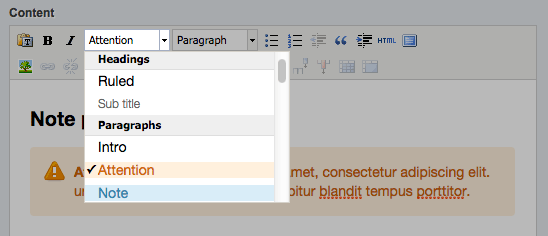

# TinyTidy for SilverStripe

This module mainly serves as an example of how to customise the 'styles' dropdown menu in the TinyMCE editor to control which elements certain styles can be applied to and whether or not they should replace other styles.

It also shows how to customise the buttons in the editor by rebuilding the rows (rather than removing buttons), and remove the h1 option from the tag menu.

## Requirements

SilverStripe 3~ (tested in 3.1, not sure about 3.0)

## Installation

**Composer / Packagist ([best practice](http://doc.silverstripe.org/framework/en/trunk/installation/composer))**
`cd` to your website's root directory then run this command: `composer require jonom/silverstripe-tinytidy` then run a dev/build?flush=1.

**Manually**
Download, place the folder in your project root, rename it to 'tinytidy' (if applicable) and run a dev/build?flush=1.

## How to use

The tinytidy/\_config.php file contains an example configuration for TinyMCE and comments which explain what various options do. Either uncomment and edit that file directly, or copy the contents to your mysite/\_config.php and edit as required to suit your needs.

## Maintainer contact

[Jono Menz](https://jonomenz.com)

## Sponsorship

If you want to boost morale of the maintainer you're welcome to make a small monthly donation through [**GitHub**](https://github.com/sponsors/jonom), or a one time donation through [**PayPal**](https://www.paypal.com/cgi-bin/webscr?cmd=_s-xclick&hosted_button_id=Z5HEZREZSKA6A). ❤️ Thank you!

Please also feel free to [get in touch](https://jonomenz.com) if you want to hire the maintainer to develop a new feature, or discuss another opportunity.